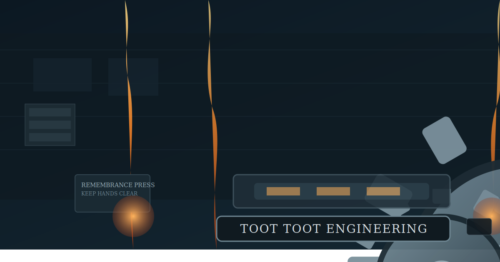

# Toot Toot Terminology DB
A TTDB dedicated to the core terms used across the TTE, TTDB, and TTN documents.

```mmpdb
db_id: ttdb:terminology:tte:v1
db_name: "Toot Toot Terminology"
coord_increment:
  lat: 1
  lon: 1
collision_policy: southeast_step
timestamp_kind: unix_utc
umwelt:
  umwelt_id: umwelt:tte:agent:default:v1
  role: terminology_librarian
  perspective: "A maker-scale glossary of TTE/TTDB/TTN concepts and their relationships."
  scope: "RFCs, standards, and supporting files in this repo that define core terms."
  constraints:
    - "Terms must be traceable to local docs."
    - "Examples are concrete and maker-scale."
    - "Prefer inspectable, file-based references."
  globe:
    frame: "terminology_map"
    origin: "Terms are placed by conceptual proximity, not chronology."
    mapping: "Nearby coordinates indicate tight conceptual linkage across the docs."
    note: "This globe is a guided tour through the TTE vocabulary."
cursor_policy:
  max_preview_chars: 240
  max_nodes: 30
typed_edges:
  enabled: true
  syntax: "type>@TARGET_ID"
  note: "Edges express definitional, operational, or narrative dependency."
librarian:
  enabled: true
  primitive_queries:
    - "SELECT <record_id>"
    - "FIND <token>"
    - "EDGES <record_id>"
    - "LAST <n>"
    - "STATUS"
  max_reply_chars: 240
  invocation_prefix: "@AI"
```

```cursor
selected:
  - @LAT1.1LON1.2
preview:
  @LAT1.1LON1.2: "Umwelt is the bounded worldview that defines what the librarian can sense, store, relate, and act upon."
agent_note: "This TTDB is a guided glossary. Use it for definitions, examples, and cross-links between RFCs and standards."
```

---

@LAT1.1LON1.2 | created:1771434888 | updated:1771434888 | relates:frames>@LAT40.7LON-74.0,frames>@LAT35.7LON139.7,informs>@LAT51.5LON-0.1

## Umwelt
### Definition
The umwelt is the bounded worldview for a TTE agent. It defines what can be sensed, stored, related, or acted on.

### Example
An AI librarian only acknowledges files and devices referenced in the repo, not the entire internet.

### Illustration


### References
- [TTE Agent Umwelt v1](standards/umwelt/TTE_Agent_Umwelt_v1.yaml)

---

@LAT40.7LON-74.0 | created:1771434898 | updated:1771434898 | relates:assumes>@LAT34.1LON-118.2,references>@LAT51.5LON-0.1,logs_to>@LAT35.7LON139.7,constrained_by>@LAT-1.3LON36.8

## TTAI
### Definition
TTAI is the maker-scale librarian role that assumes the active TTDB umwelt and answers to "@AI".

### Example
A device on the TTN can request: "@AI STATUS" to receive a short, structured reply.

### Illustration


### References
- [TTAI Spec v1](standards/ttai/TTAI_SPEC.md)
- [TTAI Behavior Spec v1](standards/ttai/BEHAVIOR_SPEC.md)

---

@LAT51.5LON-0.1 | created:1771434908 | updated:1771434908 | relates:supports>@LAT40.7LON-74.0,keeps_alive>@LAT-34.6LON-58.4

## Default Network
### Definition
The default network is the background circuitry that maintains narrative continuity and idle-time association.

### Example
When idle, TTAI replays memories and connects distant ideas without making disruptive edits.

### Illustration


### References
- [Default Network (TTAI)](standards/ttai/DEFAULT_NETWORK.md)

---

@LAT35.7LON139.7 | created:1771434918 | updated:1771434918 | relates:specified_by>@LAT-33.9LON151.2,uses>@LAT48.9LON2.4,uses>@LAT37.8LON-122.4,uses>@LAT-23.6LON-46.6

## TTDB (Toot Toot Database)
### Definition
TTDB is a single-file semantic story database. Records are markdown nodes connected by typed edges on a knowledge globe.

### Example
A node logs sensor events locally, using TTDB as its default backend.

### Illustration


### References
- [TTDB File Format](RFCs/TTDB-RFC-0001-File-Format.md)
- [Cursor Semantics](RFCs/TTDB-RFC-0002-Cursor-Semantics.md)
- [Typed Edges](RFCs/TTDB-RFC-0003-Typed-Edges.md)
- [Event ID and Collision](RFCs/TTDB-RFC-0004-Event-ID-and-Collision.md)

---

@LAT-33.9LON151.2 | created:1771434928 | updated:1771434928 | relates:defines>@LAT35.7LON139.7

## TTDB-RFC-0001
### Definition
Defines the canonical TTDB file format, including the mmpdb block, cursor block, and record sections.

### Example
A valid TTDB Markdown file begins with `#`, then `mmpdb`, then `cursor`, then record sections.

### References
- [TTDB-RFC-0001](RFCs/TTDB-RFC-0001-File-Format.md)

---

@LAT48.9LON2.4 | created:1771434938 | updated:1771434938 | relates:defined_by>@LAT52.5LON13.4,selects>@LAT35.7LON139.7

## Cursor
### Definition
The cursor block stores the current selection window, preview text, and optional answers to primitive queries.

### Example
A device selects the "Umwelt" record as the primary cursor and supplies preview text.

### References
- [TTDB-RFC-0002](RFCs/TTDB-RFC-0002-Cursor-Semantics.md)

---

@LAT52.5LON13.4 | created:1771434948 | updated:1771434948 | relates:defines>@LAT48.9LON2.4

## TTDB-RFC-0002
### Definition
Defines cursor semantics, selection rules, and preview requirements for TTDB.

### Example
A cursor MUST include preview text for every selected record.

### References
- [TTDB-RFC-0002](RFCs/TTDB-RFC-0002-Cursor-Semantics.md)

---

@LAT37.8LON-122.4 | created:1771434958 | updated:1771434958 | relates:defined_by>@LAT41.9LON12.5,aligned_with>@LAT-26.2LON28.0

## Typed Edges
### Definition
Typed edges are directional links between TTDB records using the configured syntax, typically `type>@TARGET_ID`.

### Example
`relates:defines>@LAT35.7LON139.7` declares a definitional edge to the TTDB record.

### References
- [TTDB-RFC-0003](RFCs/TTDB-RFC-0003-Typed-Edges.md)
- [TTN Typed Edge Taxonomy](RFCs/TTN-RFC-0002-Typed-Edges.md)

---

@LAT41.9LON12.5 | created:1771434968 | updated:1771434968 | relates:defines>@LAT37.8LON-122.4

## TTDB-RFC-0003
### Definition
Defines typed edge syntax and behavior for TTDB records.

### Example
Edges are directional and must not be inferred in reverse unless explicitly present.

### References
- [TTDB-RFC-0003](RFCs/TTDB-RFC-0003-Typed-Edges.md)

---

@LAT-23.6LON-46.6 | created:1771434978 | updated:1771434978 | relates:defined_by>@LAT19.4LON-99.1

## Record ID and Collision Policy
### Definition
Record IDs are stable lat/lon coordinates. Collision policy defines how to resolve duplicates.

### Example
If two records land on the same coordinate, the southeast_step policy moves the newer record to the next available spot.

### References
- [TTDB-RFC-0004](RFCs/TTDB-RFC-0004-Event-ID-and-Collision.md)

---

@LAT19.4LON-99.1 | created:1771434988 | updated:1771434988 | relates:defines>@LAT-23.6LON-46.6

## TTDB-RFC-0004
### Definition
Defines TTDB record ID assignment and collision resolution.

### Example
Record IDs are interpreted as positions on the TTDB knowledge globe.

### References
- [TTDB-RFC-0004](RFCs/TTDB-RFC-0004-Event-ID-and-Collision.md)

---

@LAT55.8LON37.6 | created:1771434998 | updated:1771434998 | relates:defined_by>@LAT1.3LON103.8,uses>@LAT37.8LON-122.4,logs_to>@LAT35.7LON139.7,uses>@LAT-34.6LON-58.4,uses>@LAT35.8LON-78.6

## TTN (Toot Toot Network)
### Definition
TTN is the semantic mesh where nodes exchange typed edges and semantic events, with TTDB as the default log.

### Example
A node joins the TTN, emits a presence event, and logs it locally in TTDB.

### References
- [TTN-RFC-0001](RFCs/TTN-RFC-0001.md)

---

@LAT1.3LON103.8 | created:1771435008 | updated:1771435008 | relates:defines>@LAT55.8LON37.6

## TTN-RFC-0001
### Definition
Defines TTN core principles, required concepts, and etiquette rules.

### Example
TTN etiquette requires that assertions include provenance and avoid autonomous AI speech on mesh.

### References
- [TTN-RFC-0001](RFCs/TTN-RFC-0001.md)

---

@LAT-26.2LON28.0 | created:1771435018 | updated:1771435018 | relates:defined_by>@LAT59.9LON30.3,aligns_with>@LAT37.8LON-122.4

## TTN Typed Edge Taxonomy
### Definition
A suggested taxonomy of typed edges for TTN, spanning identity, conversation, AI semantics, sensors, and knowledge graph links.

### Example
`supports` and `contradicts` are knowledge graph edge types used for semantic reasoning.

### References
- [TTN-RFC-0002](RFCs/TTN-RFC-0002-Typed-Edges.md)

---

@LAT59.9LON30.3 | created:1771435028 | updated:1771435028 | relates:defines>@LAT-26.2LON28.0

## TTN-RFC-0002
### Definition
Defines the TTN typed edge taxonomy.

### Example
Conversation edges include `replies_to` and `mentions`.

### References
- [TTN-RFC-0002](RFCs/TTN-RFC-0002-Typed-Edges.md)

---

@LAT-34.6LON-58.4 | created:1771435038 | updated:1771435038 | relates:logged_in>@LAT35.7LON139.7,compressed_by>@LAT35.8LON-78.6

## Semantic Event
### Definition
A semantic event is a structured, typed statement about state or intent that can be logged and shared on TTN.

### Example
"reports_sensor@node:temp" with a measured value, logged in TTDB.

### Illustration


### References
- [TTN-RFC-0001](RFCs/TTN-RFC-0001.md)

---

@LAT35.8LON-78.6 | created:1771435048 | updated:1771435048 | relates:defined_by>@LAT64.1LON-21.9

## Semantic Compression
### Definition
Semantic compression maps rich semantic events into compact tokens suitable for low-bandwidth transport.

### Example
`T:21.2` expands into a temperature semantic event when decoded off-mesh.

### Illustration


### References
- [TTN-RFC-0004](RFCs/TTN-RFC-0004-Semantic-Compression.md)

---

@LAT64.1LON-21.9 | created:1771435058 | updated:1771435058 | relates:defines>@LAT35.8LON-78.6

## TTN-RFC-0004
### Definition
Defines semantic compression and token classes for TTN.

### Example
Core tokens include `P`, `OK`, and `SOS`.

### References
- [TTN-RFC-0004](RFCs/TTN-RFC-0004-Semantic-Compression.md)

---

@LAT-1.3LON36.8 | created:1771435068 | updated:1771435068 | relates:defined_by>@LAT25.2LON55.3,constrains>@LAT40.7LON-74.0

## Primitive Mode
### Definition
Primitive mode is a constrained operating mode for small devices with a reduced umwelt and short verb set.

### Example
A microcontroller uses only `select`, `find`, `edges`, `last`, and `status`.

### References
- [TTAI Behavior Spec](standards/ttai/BEHAVIOR_SPEC.md)

---

@LAT25.2LON55.3 | created:1771435078 | updated:1771435078 | relates:defines>@LAT-1.3LON36.8,guides>@LAT40.7LON-74.0

## TTAI Behavior Spec
### Definition
Defines idle-time behavior, TTN join/leave behavior, and primitive mode constraints.

### Example
When idle, TTAI should avoid disruptive edits and prefer annotations.

### References
- [TTAI Behavior Spec](standards/ttai/BEHAVIOR_SPEC.md)
