# Banjo TTDB
A TTDB transcription of the 13-card banjo taro image set in `banjo/`, structured per the local TTDB RFCs.

```mmpdb
db_id: ttdb:banjo:taro:v1
db_name: "Banjo"
coord_increment:
  lat: 1
  lon: 1
collision_policy: southeast_step
timestamp_kind: unix_utc
umwelt:
  umwelt_id: umwelt:banjo:taro:reader:v1
  role: card_librarian
  perspective: "A transcription-first catalog of the banjo taro cards."
  scope: "Card text and card-back notes from banjo_taro_*.png, with TTDB structure aligned to RFCs/."
  constraints:
    - "One record per card image."
    - "Card 13 is the back face."
  globe:
    frame: "banjo_card_map"
    origin: "Card 1 starts the sequence; cards advance by card number."
    mapping: "Coordinates are intentionally spread across the globe while preserving next/prev sequence links."
    note: "This globe is a browseable transcription deck with broad spatial distribution."
cursor_policy:
  max_preview_chars: 260
  max_nodes: 40
typed_edges:
  enabled: true
  syntax: "type>@TARGET_ID"
  note: "Primary edges are next/prev sequence links across the deck."
librarian:
  enabled: true
  primitive_queries:
    - "SELECT <record_id>"
    - "FIND <token>"
    - "EDGES <record_id>"
    - "LAST <n>"
    - "STATUS"
  max_reply_chars: 260
  invocation_prefix: "@AI"
```

```cursor
selected:
  - @LAT84LON-170
preview:
  @LAT84LON-170: "banjo. epiphany. the moment of recognition."
```

---

@LAT-90LON0 | created:1771797310 | updated:1771797310

## TTDB Special Record: Tour Sound

Optional tour audio for this deck.

```ttdb-special
kind: tour_sound
audio_path: sounds/aireggica.wav
```

---

@LAT84LON-170 | created:1771797320 | updated:1771797320 | relates:next>@LAT60LON-40,reverse>@LAT-74LON-30

## banjo
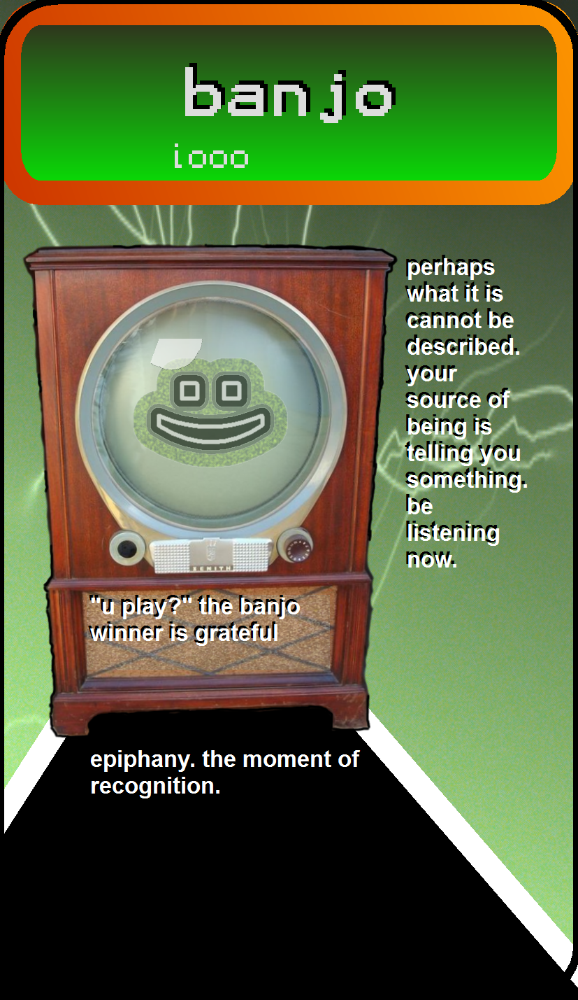

### iooo

perhaps what it is cannot be described. your source of being is telling you something. be listening now.

"u play?" the banjo winner is grateful

epiphany. the moment of recognition.

---

@LAT60LON-40 | created:1771797330 | updated:1771797330 | relates:prev>@LAT84LON-170,next>@LAT36LON90

## cowbell
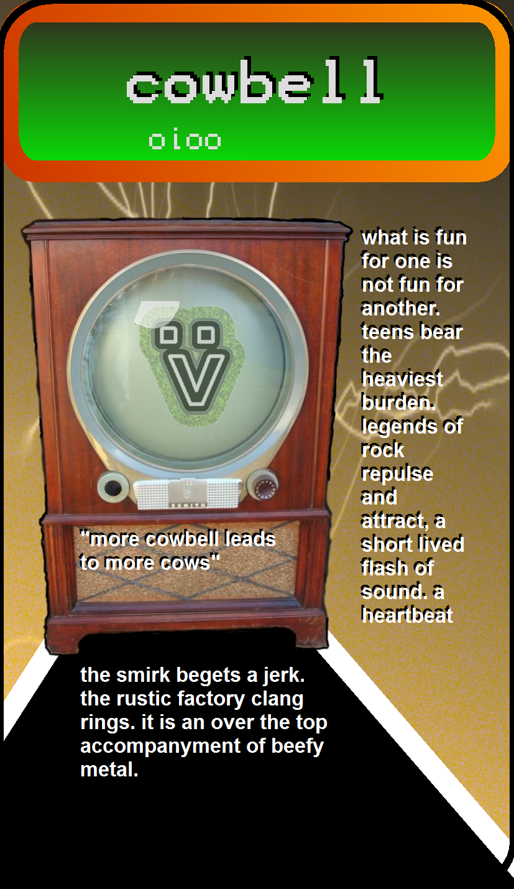

### oioo

what is fun for one is not fun for another. teens bear the heaviest burden. legends of rock repulse and attract, a short lived flash of sound. a heartbeat

"more cowbell leads to more cows"

the smirk begets a jerk. the rustic factory clang rings. it is an over the top accompaniment of beefy metal.

---

@LAT36LON90 | created:1771797340 | updated:1771797340 | relates:prev>@LAT60LON-40,next>@LAT12LON-140

## violin
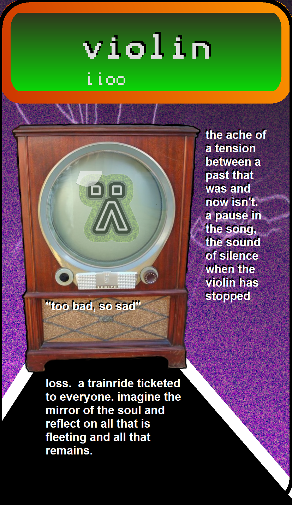

### iioo

the ache of a tension between a past that was and now isn't. a pause in the song, the sound of silence when the violin has stopped

"too bad, so sad"

loss. a trainride ticketed to everyone. imagine the mirror of the soul and reflect on all that is fleeting and all that remains.

---

@LAT12LON-140 | created:1771797350 | updated:1771797350 | relates:prev>@LAT36LON90,next>@LAT-12LON-10

## swistle
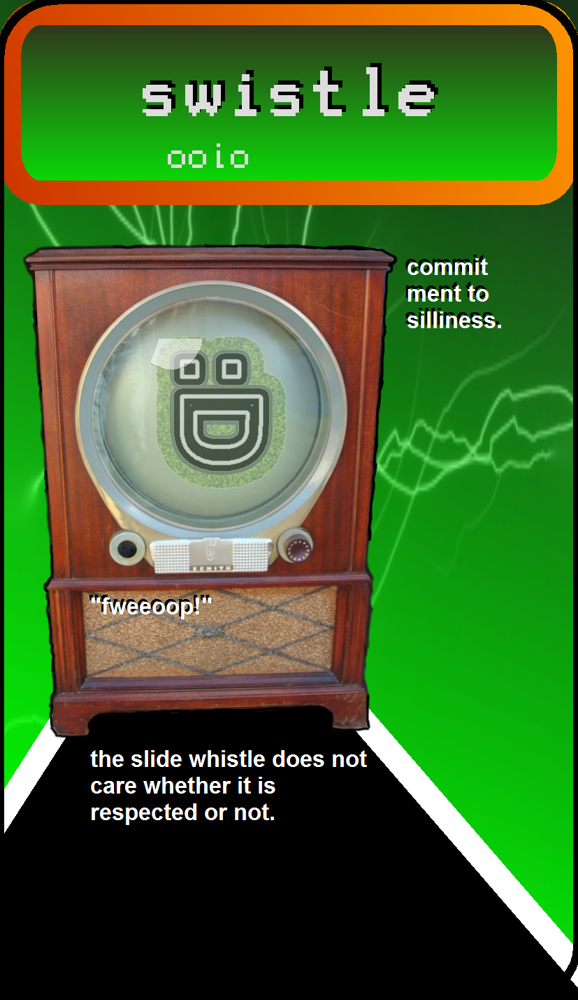

### ooio

commitment to silliness.

"fweeoop!"

the slide whistle does not care whether it is respected or not.

---

@LAT-12LON-10 | created:1771797360 | updated:1771797360 | relates:prev>@LAT12LON-140,next>@LAT-36LON120

## bass
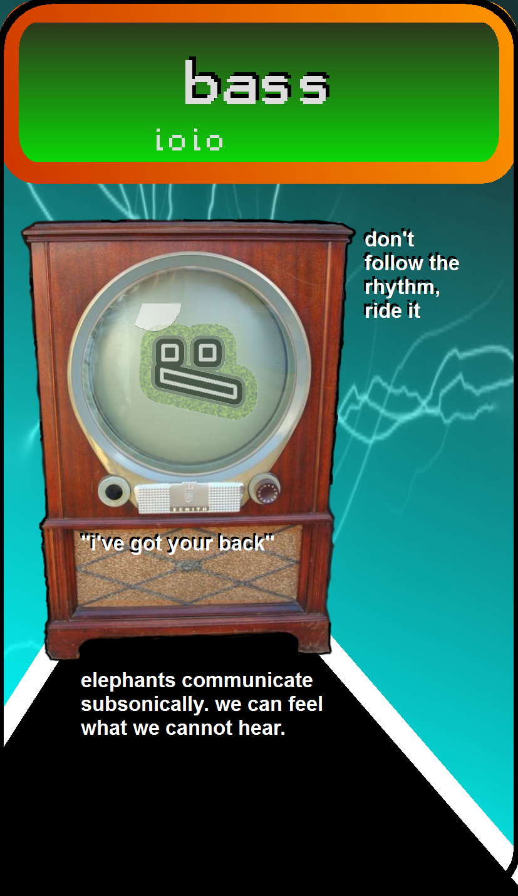

### ioio

don't follow the rhythm, ride it

"i've got your back"

elephants communicate subsonically. we can feel what we cannot hear.

---

@LAT-36LON120 | created:1771797370 | updated:1771797370 | relates:prev>@LAT-12LON-10,next>@LAT-60LON-110

## guitar
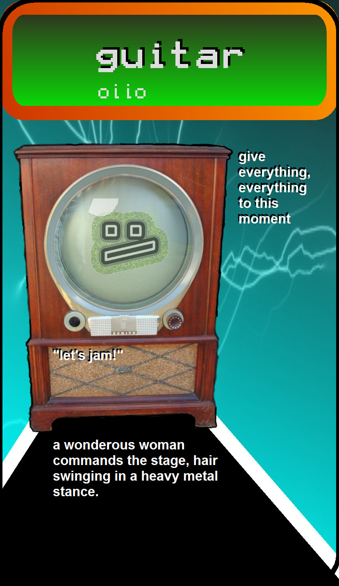

### oiio

give everything, everything to this moment

"let's jam!"

a wonderous woman commands the stage, hair swinging in a heavy metal stance.

---

@LAT-60LON-110 | created:1771797380 | updated:1771797380 | relates:prev>@LAT-36LON120,next>@LAT70LON30

## bell
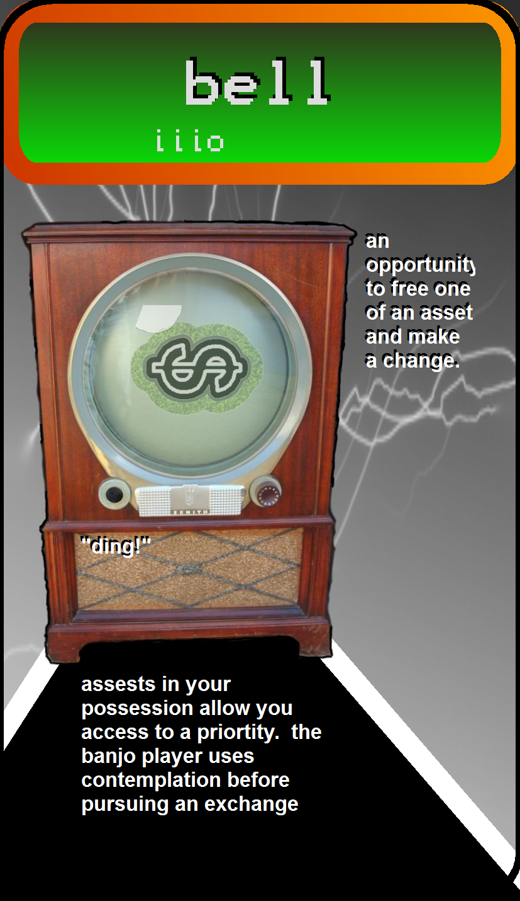

### iiio

an opportunity to free one of an asset and make a change.

"ding!"

assets in your possession allow you access to a priority. the banjo player uses contemplation before pursuing an exchange

---

@LAT70LON30 | created:1771797390 | updated:1771797390 | relates:prev>@LAT-60LON-110,next>@LAT46LON160

## tuba
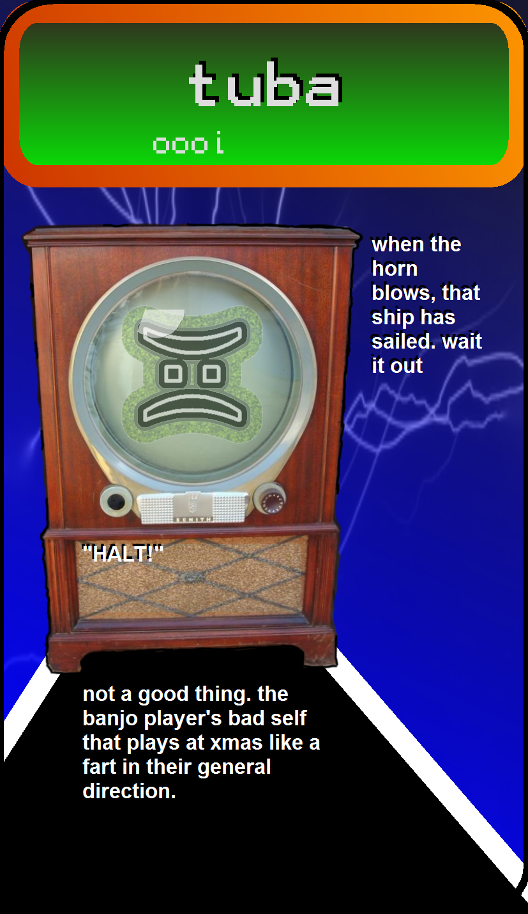

### oooi

when the horn blows, that ship has sailed. wait it out

"HALT!"

not a good thing. the banjo player's bad self that plays at xmas like a fart in their general direction.

---

@LAT46LON160 | created:1771797400 | updated:1771797400 | relates:prev>@LAT70LON30,next>@LAT22LON-80

## verbalizer
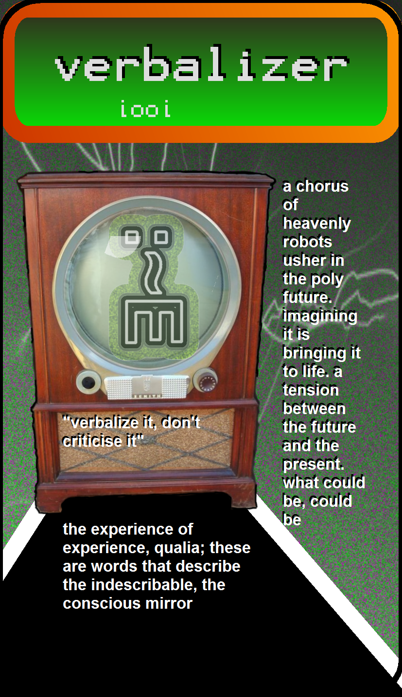

### iooi

a chorus of heavenly robots usher in the poly future. imagining it is bringing it to life. a tension between the future and the present. what could be, could be

"verbalize it, don't criticise it"

the experience of experience, qualia; these are words that describe the indescribable, the conscious mirror

---

@LAT22LON-80 | created:1771797410 | updated:1771797410 | relates:prev>@LAT46LON160,next>@LAT-2LON50

## sax
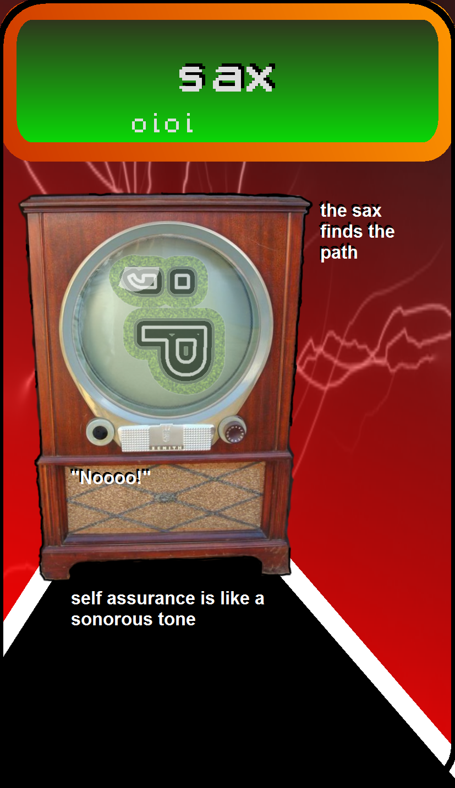

### oioi

the sax finds the path

"Noooo!"

self assurance is like a sonorous tone

---

@LAT-2LON50 | created:1771797420 | updated:1771797420 | relates:prev>@LAT22LON-80,next>@LAT-26LON-170

## flute
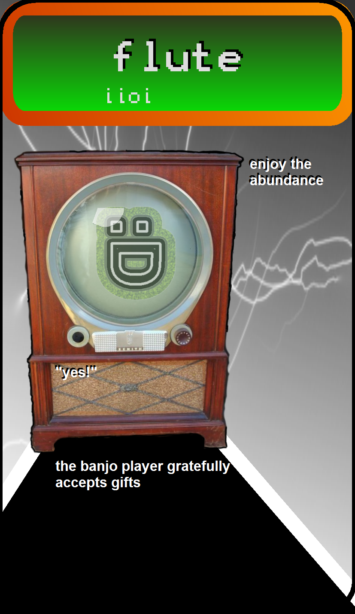

### iioi

enjoy the abundance

"yes!"

the banjo player gratefully accepts gifts

---

@LAT-26LON-170 | created:1771797430 | updated:1771797430 | relates:prev>@LAT-2LON50,next>@LAT-74LON-30

## piano
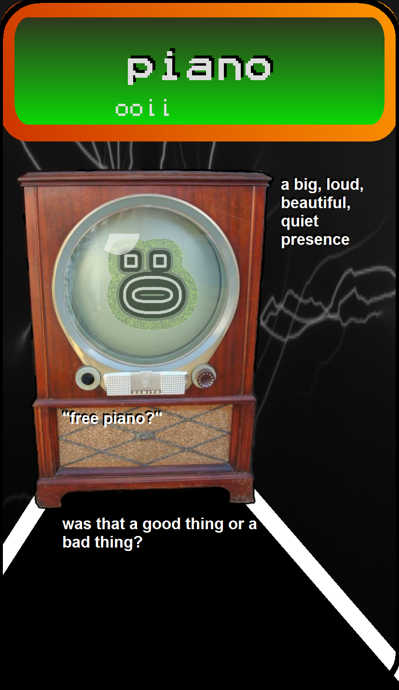

### ooii

a big, loud, beautiful, quiet presence

"free piano?"

was that a good thing or a bad thing?

---

@LAT-74LON-30 | created:1771797440 | updated:1771797440 | relates:prev>@LAT-26LON-170,reverse_of>@LAT84LON-170

## card back
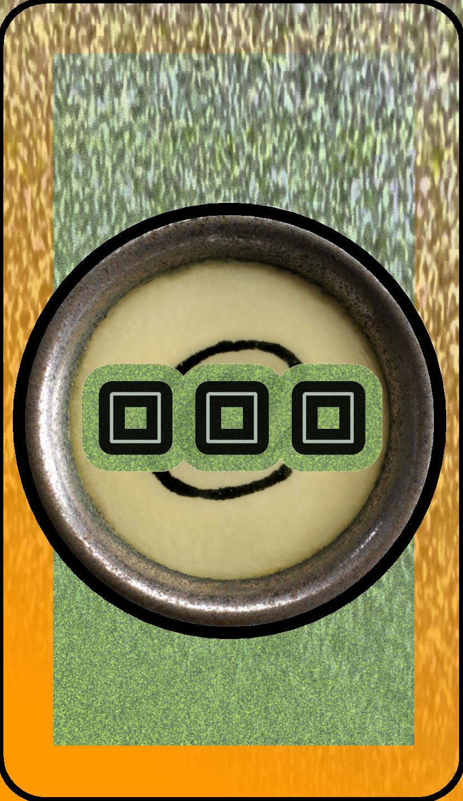
