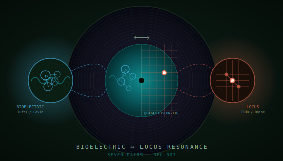
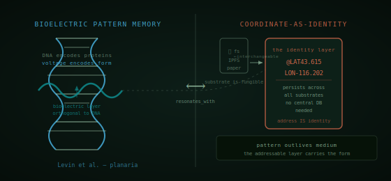
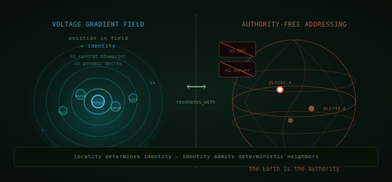
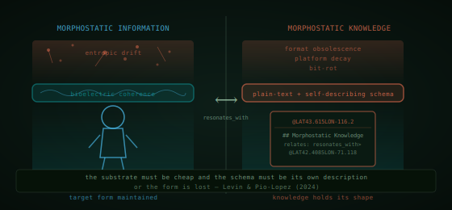
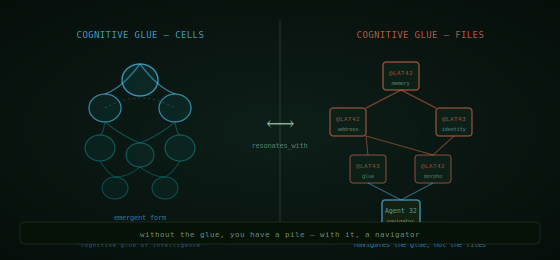
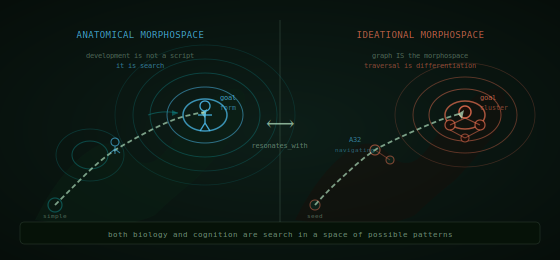
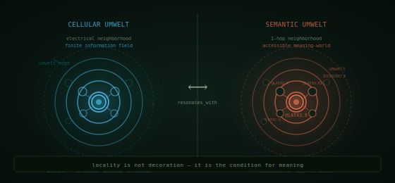
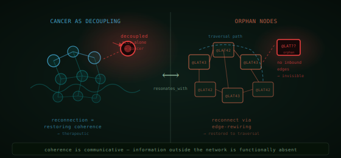

# Bioelectric ⟷ TTE Resonance
A TTDB graph mapping Michael Levin's developmental bioelectricity onto the Toot Toot Engineering Database system. Both treated as parallel substrate-independent information layers. Seven resonance pairs spanning two continental clusters.

```mmpdb
db_id: ttdb:bioelectric:resonance:v1
db_name: "Bioelectric ⟷ TTE Resonance"
coord_increment:
  lat: 0.001
  lon: 0.001
collision_policy: southeast_step
timestamp_kind: unix_utc
umwelt:
  umwelt_id: umwelt:bioelectric:resonance:v1
  role: resonance_cartographer
  perspective: "Mapping deep structural similarities between Michael Levin's developmental bioelectricity and the TTDB framework — patterns in memory, harmony, and belonging."
  scope: "Bioelectric research (Levin et al., Tufts Allen Discovery Center) and TTE RFCs for TTDB, TTN, and A32."
  globe:
    frame: "resonance_map"
    origin: "Tufts Allen Discovery Center anchors the bioelectric cluster near Medford, MA. Boise anchors the TTE cluster."
    mapping: "East cluster (lat 42.4, lon -71): bioelectric concepts. West cluster (lat 43.6, lon -116): TTE analogs. Cross-continental edges carry resonance."
    note: "Select the cover record to play all seven resonance pairs in sequence."
cursor_policy:
  max_preview_chars: 240
  max_nodes: 30
typed_edges:
  enabled: true
  syntax: "type>@TARGET_ID"
  note: "resonates_with edges span the two clusters. child_of edges link each concept to its origin cluster."
```

```cursor
selected:
  - @LAT43.01LON-93.66
preview:
  @LAT43.01LON-93.66: "Patterns in memory, harmony, and belonging. Select this record to play all seven resonance pairs — from memory substrate to decoupling and back."
```

---

@LAT43.01LON-93.66 | created:1745884800 | type:scene | relates:opens>@LAT43.3LON-71.1,opens>@LAT44.4LON-116.2,opens>@LAT43.1LON-70.4,opens>@LAT44.2LON-115.5

## The Resonance Record



What if the deepest pattern in developmental biology was available in your file system?

Michael Levin's lab at the Tufts Allen Discovery Center studies how cells coordinate using voltage gradients — a layer of information completely orthogonal to DNA. Three thousand miles west, the Toot Toot (free, open-source, no dependencies) Database framework addresses knowledge by geographic coordinates, maintaining semantic structure in plain text files — a layer completely orthogonal to databases.

Neither field set out to find the other. Yet the structural signatures are identical: substrate-independence, authority-free addressing, morphostasis, cognitive glue, morphospace navigation, umwelt-bounded perception, and decoupling as pathology.

Seven pairs. Two clusters. One record.

> This is a scene record. Select it and the globe will traverse all seven resonance pairs automatically — alternating between the bioelectric cluster near Medford, Massachusetts and the TTE cluster near Boise, Idaho.

```ttdb-scene
start_node: @LAT43.3LON-71.1
loop: false

edge: bloom | from: @LAT43.3LON-71.1 | to: @LAT44.4LON-116.2 | hold_ms: 9000
edge: next | from: @LAT44.4LON-116.2 | to: @LAT43.1LON-70.4 | hold_ms: 9000
edge: bloom | from: @LAT43.1LON-70.4 | to: @LAT44.2LON-115.5 | hold_ms: 9000
edge: next | from: @LAT44.2LON-115.5 | to: @LAT42.5LON-70.3 | hold_ms: 9000
edge: bloom | from: @LAT42.5LON-70.3 | to: @LAT43.6LON-115.4 | hold_ms: 9000
edge: next | from: @LAT43.6LON-115.4 | to: @LAT41.9LON-70.4 | hold_ms: 9000
edge: bloom | from: @LAT41.9LON-70.4 | to: @LAT43.0LON-115.5 | hold_ms: 9000
edge: next | from: @LAT43.0LON-115.5 | to: @LAT41.7LON-71.1 | hold_ms: 9000
edge: bloom | from: @LAT41.7LON-71.1 | to: @LAT42.8LON-116.2 | hold_ms: 9000
edge: next | from: @LAT42.8LON-116.2 | to: @LAT41.9LON-71.8 | hold_ms: 9000
edge: bloom | from: @LAT41.9LON-71.8 | to: @LAT43.0LON-116.9 | hold_ms: 9000
edge: next | from: @LAT43.0LON-116.9 | to: @LAT42.5LON-71.9 | hold_ms: 9000
edge: bloom | from: @LAT42.5LON-71.9 | to: @LAT43.6LON-117.0 | hold_ms: 9000
edge: return_home | from: @LAT43.6LON-117.0 | to: @LAT43.01LON-93.66 | hold_ms: 12000
```

---

@LAT42.5LON-71.1 | created:1745884801 | relates:parent_of>@LAT43.3LON-71.1,parent_of>@LAT43.1LON-70.4,parent_of>@LAT42.5LON-70.3,parent_of>@LAT41.9LON-70.4,parent_of>@LAT41.7LON-71.1,parent_of>@LAT41.9LON-71.8,parent_of>@LAT42.5LON-71.9

## Tufts Allen Discovery Center

The bioelectric cluster of this graph is anchored here, near Medford, Massachusetts — home of Michael Levin's lab and decades of research into how bodies remember their form.

The central claim: cells communicate through voltage gradients across their membranes, and these gradients carry a layer of information that is **not encoded in DNA**. It is a pattern layer. It can be briefly altered. The alteration persists. The substrate (protein, lipid, tissue) is replaced over time, but the voltage pattern continues instructing new cells to build the old form.

This is not metaphor. Levin's lab has demonstrated it in planaria — flatworms regenerated with two heads, maintained over multiple regeneration cycles, with no continued treatment required. The bioelectric field was altered; the field remembered; the body followed the field.

- **Cluster**: bioelectric
- **Role**: origin anchor
- **Geographic ref**: 42.4075°N, 71.119°W (Medford, MA)
- **All child nodes**: seven paired bioelectric concepts surrounding this position

> From here the globe shows seven bioelectric concepts, each `resonates_with` a TTE analog in the western cluster at Boise.

---

@LAT43.6LON-116.2 | created:1745884802 | relates:parent_of>@LAT44.4LON-116.2,parent_of>@LAT44.2LON-115.5,parent_of>@LAT43.6LON-115.4,parent_of>@LAT43.0LON-115.5,parent_of>@LAT42.8LON-116.2,parent_of>@LAT43.0LON-116.9,parent_of>@LAT43.6LON-117.0

## TTE Origin

The TTE cluster is anchored near Boise, Idaho — chosen as the western counterpoint to the Tufts eastern cluster. TTE is a coordinate-addressed semantic graph where every node is a position on the Earth.

The central claim: persistent, navigable knowledge does not require a database server. Geographic coordinates — `@LAT43.6LON-116.2` — serve as permanent identifiers. The coordinate IS the identity. The underlying storage medium (filesystem, IPFS, paper, memory) is interchangeable. A TTDB file can be copied, forked, printed, and reconstructed from any medium and the coordinate addresses remain valid.

This is not a quirk of the file format. It is the same structural move that biology made: bind the information to an addressing system orthogonal to the substrate. Let the pattern outlive the medium.

- **Cluster**: TTE
- **Role**: origin anchor
- **Geographic ref**: 43.615°N, 116.2023°W (Boise, ID)
- **All child nodes**: seven TTE analog concepts surrounding this position

> From here the globe shows seven TTDB concepts, each `resonates_with` a bioelectric concept in the eastern cluster at Tufts.

---

@LAT43.3LON-71.1 | created:1745884803 | relates:resonates_with>@LAT44.4LON-116.2,child_of>@LAT42.5LON-71.1

## Bioelectric Pattern Memory



Voltage gradients across cell membranes carry **morphological memory** that is not encoded in DNA. The genome provides the parts catalog; the bioelectric field carries the assembly instructions.

The clearest evidence: Levin's lab altered the bioelectric state of planaria flatworms with a brief ion-channel intervention, then let them regenerate normally. The flatworms grew two heads — not because their DNA changed, but because the bioelectric field had been reprogrammed to specify "head" at both ends. When these two-headed worms were cut and allowed to regenerate *again*, with no further treatment, they still grew two heads. The field had remembered.

This is **substrate-independent memory**. The individual cells, proteins, and lipids that carried the original altered field were replaced through normal tissue turnover. The voltage pattern persisted in the network, not in any individual component. A new cell entering the field was instructed by the field, not by its lineage.

The information layer and the physical substrate are **decoupled**. They run in parallel. The substrate is temporary; the pattern is the record.

- `resonates_with` → Coordinate-as-Identity (`@LAT44.4LON-116.2`)
- `child_of` → Tufts Allen Discovery Center (`@LAT42.5LON-71.1`)
- `instance_of` → Substrate-Independent Memory (`@LAT0LON0`)

---

@LAT44.4LON-116.2 | created:1745884804 | relates:resonates_with>@LAT43.3LON-71.1,child_of>@LAT43.6LON-116.2

## Coordinate-as-Identity

TTDB nodes are addressed by `@LATxLONy` coordinates — geographic positions on the Earth. These coordinates persist across any storage system with no central database, no server, no registry. The address IS the identity.

Consider what this means for substrate-independence: a TTDB file can be stored on a filesystem, synced to IPFS, printed on paper, and typed back in from the paper. In each case, `@LAT44.4LON-116.2` refers to the same node. No UUID server issued that identifier. No database assigned it. The Earth is the authority, and the Earth does not go down for maintenance.

When Agent 32 traverses a TTDB graph, it is not querying a database — it is reading coordinate addresses and following edges. The underlying storage can be replaced without changing any identifier. The pattern (the graph of addresses and edges) persists independently of the substrate (which files, which disk, which server holds the bytes).

This is the same move biology made: encode the pattern in a layer orthogonal to the physical substrate, and let the substrate be fungible. The cell doesn't care whether a lipid molecule is old or new — it cares about the voltage at its membrane. The agent doesn't care whether the file is on ext4 or IPFS — it cares about the coordinate.

> **Resonance**: Both encode persistent information in a substrate orthogonal to the "obvious" one — DNA in biology, the database server in software. The addressable layer carries the pattern; the material beneath is fungible.

- `resonates_with` → Bioelectric Pattern Memory (`@LAT43.3LON-71.1`)
- `child_of` → TTE Origin (`@LAT43.6LON-116.2`)

---

@LAT43.1LON-70.4 | created:1745884805 | relates:resonates_with>@LAT44.2LON-115.5,child_of>@LAT42.5LON-71.1

## Voltage Gradient Addressing



Each cell's **identity** in the morphological program is determined by its bioelectric position relative to its neighbors — not by a central blueprint, not by genomic decree, not by any single coordinating cell issuing instructions.

In Levin's framework, cells sense their voltage relative to surrounding cells. A cell at a high-potential position "knows" it is at the head end of an axis. A cell at a low-potential position "knows" it is at the tail end. This positional identity is what makes a head cell a head cell — not its DNA (every cell in the body has the same DNA) but its field position. Change the field, change the identity.

No cell is in charge of telling other cells where they are. The field is self-referential: every cell contributes to the field, and every cell reads the field. It is a distributed, authority-free addressing system where **position is identity** and identity is determined locally, by sensing immediate voltage gradients.

There is no morphological DNS. There is no genome-issued address. The field is the registry, and the field belongs to no one.

- `resonates_with` → Authority-Free Addressing (`@LAT44.2LON-115.5`)
- `child_of` → Tufts Allen Discovery Center (`@LAT42.5LON-71.1`)

---

@LAT44.2LON-115.5 | created:1745884806 | relates:resonates_with>@LAT43.1LON-70.4,child_of>@LAT43.6LON-116.2

## Authority-Free Addressing

Geographic coordinates require no DNS lookup, no registry query, no permission from any authority. `@LAT44.2LON-115.5` is a valid TTDB identifier the moment you write it. Every agent that can read coordinates can find it. No one owns it. No one can revoke it.

This is not a technical quirk — it is a design principle. The Earth's coordinate system has existed for centuries, is stable, is understood by every mapping system in every country, and is governed by physics rather than by any corporation or standards body. To anchor knowledge to coordinates is to anchor it to something more permanent than any server, any company, or any protocol.

Like the bioelectric field, the TTDB coordinate space is **self-referential without a center**. Every node contributes to the graph by existing at a coordinate. Every node can find its neighbors by their coordinates. No node is in charge. Position determines identity; identity determines neighborhood; neighborhood determines traversal.

Locality is the only authority. The field — bioelectric or geographic — is the only registry.

> **Resonance**: Position-based identity without central authority. Locality determines identity; identity admits deterministic neighbors.

- `resonates_with` → Voltage Gradient Addressing (`@LAT43.1LON-70.4`)
- `child_of` → TTE Origin (`@LAT43.6LON-116.2`)

---

@LAT42.5LON-70.3 | created:1745884807 | relates:resonates_with>@LAT43.6LON-115.4,child_of>@LAT42.5LON-71.1

## Morphostatic Information



Levin and Pio-Lopez (2024) reframe aging itself as **"a loss of morphostatic information"** — the body gradually forgetting its target form. Cancer, too, is in this framework a failure of morphostatic coherence: cells that have lost access to the body-level pattern and reverted to selfish, individual-level goals.

Morphostasis is the capacity of a living system to **maintain its form against entropic drift**. Over time, cells die, molecules are replaced, tissue turns over. Left to thermodynamics alone, a body would drift toward structural chaos. What keeps it coherent is the bioelectric field — a continuously maintained voltage pattern that instructs incoming cells what form to build.

This is not passive storage. The bioelectric field requires active maintenance. Coherent ion-channel activity, gap junction coupling, and electromagnetic coordination across tissues are all required to keep the morphostatic signal intact. The moment that coordination breaks down, the pattern begins to drift.

The body's form is not a fixed blueprint. It is a **continuously negotiated consensus** between millions of cells, maintained through bioelectric signaling. The pattern must be actively held or it is lost.

- `resonates_with` → Morphostatic Knowledge (`@LAT43.6LON-115.4`)
- `child_of` → Tufts Allen Discovery Center (`@LAT42.5LON-71.1`)

---

@LAT43.6LON-115.4 | created:1745884808 | relates:resonates_with>@LAT42.5LON-70.3,child_of>@LAT43.6LON-116.2

## Morphostatic Knowledge

Plain-text TTDB files resist bit-rot, format obsolescence, and platform decay because **the schema is embedded in the content**. A TTDB file is self-describing: the coordinate in the header, the edge types in the `relates:` field, the section structure in the markdown — all of it is readable by any text editor in any era. No proprietary parser required. No migration tool needed. The knowledge maintains its shape without an institution.

Compare this to database-resident knowledge: when the database vendor is acquired, when the ORM changes, when the serialization format is deprecated, the knowledge is either migrated at great cost or lost. The form was held by the institution, not by the knowledge itself. When the institution forgets, the knowledge forgets.

TTDB treats morphostasis as a **design constraint**: the format must be cheap enough that any agent can maintain a copy, and the schema must be its own description, so that no single keeper is required. If those conditions are not met — if the format requires a proprietary reader, or if the schema is implicit — then the knowledge will eventually drift toward illegibility.

Like bioelectric coherence, textual self-description is the active principle that maintains form. It is not passive storage. It requires consistent discipline in how knowledge is written.

> **Resonance**: Information that maintains its own form against entropic drift. The substrate must be cheap and the schema must be its own description, or the form is lost.

- `resonates_with` → Morphostatic Information (`@LAT42.5LON-70.3`)
- `child_of` → TTE Origin (`@LAT43.6LON-116.2`)

---

@LAT41.9LON-70.4 | created:1745884809 | relates:resonates_with>@LAT43.0LON-115.5,child_of>@LAT42.5LON-71.1

## Cognitive Glue — Cells



Levin describes bioelectric networks as **"the cognitive glue of intelligence in spaces other than neural."** This is one of the most generative phrases in recent biology.

A single cell can do very little. It can grow, divide, migrate, signal, die. What a cell cannot do is build a limb, repair a wound, navigate morphospace toward a target body plan. These are collective capacities — they require a large number of cells to act as a coordinated problem-solving system. The bioelectric field is what makes that coordination possible.

Without the field, cells have local information only: the signals from their immediate neighbors, the molecules in their local environment. With the field, a cell gains access to long-range information — the voltage state of tissues many cell-lengths away. This long-range coupling is what allows a cell population to solve problems at a scale its members cannot individually access.

Levin's term is exact: the field is **glue**. It does not issue commands. It does not compute a solution. It binds individual computational agents into a collective that can navigate a problem space too large for any one agent.

- `resonates_with` → Cognitive Glue — Files (`@LAT43.0LON-115.5`)
- `child_of` → Tufts Allen Discovery Center (`@LAT42.5LON-71.1`)

---

@LAT43.0LON-115.5 | created:1745884810 | relates:resonates_with>@LAT41.9LON-70.4,child_of>@LAT43.6LON-116.2

## Cognitive Glue — Files

Individual TTDB files are, in isolation, inert documents. A file about memory substrate cannot navigate to a file about morphostasis by itself — it has no traversal capacity. What gives the graph its navigable structure are the **coordinate edges** that connect one file's address to another's.

These edges — `relates: resonates_with>@LAT42.5LON-70.3` — are the cognitive glue of the TTE knowledge system. They transform a pile of independent files into a graph that can be traversed as a single system. Agent 32 does not read files; it follows edges. The files are the substrate; the edges are the field.

Without edges, TTDB is a filesystem with fancy filenames. With edges, it is a knowledge graph that can be navigated, explored, queried, and reasoned over. The edge layer is orthogonal to the file layer — you can add, remove, or rewire edges without touching the file content. The glue can be reconfigured without rebuilding the cells.

This is why Agent 32 is described as navigating **the glue, not the files**. The agent's umwelt is the graph of edges, not the individual documents. The graph is what thinks; the files are what remember.

> **Resonance**: A coordination protocol that lets parts behave as a problem-solving whole. Without the glue, you have a pile; with it, a navigator.

- `resonates_with` → Cognitive Glue — Cells (`@LAT41.9LON-70.4`)
- `child_of` → TTE Origin (`@LAT43.6LON-116.2`)

---

@LAT41.7LON-71.1 | created:1745884811 | relates:resonates_with>@LAT42.8LON-116.2,child_of>@LAT42.5LON-71.1

## Anatomical Morphospace



Development is not a script. A genome does not contain a sequential instruction set that, executed step by step, produces a body. Instead, development is **problem-solving in morphospace** — a high-dimensional space of possible anatomical configurations — with the bioelectric field supplying the gradient that guides the search.

Morphospace is the abstract space of all possible body plans. Every animal that has ever existed, and many that have never existed, occupies a point in morphospace. Development moves an embryo through this space, from a relatively simple starting configuration toward a target — the adult form — that is specified not as a list of steps but as a **goal state** encoded in the bioelectric field.

Cells are not executing a blueprint. They are solving a problem: given their current local state, what should they do to move the collective toward the target form? The bioelectric field gives them access to information about the collective's current state relative to the target. When the field is coherent, the search converges. When the field is disrupted, the search may converge on a different target — producing a different body.

This reframing — development as search, body as solution — is Levin's most radical contribution to biology.

- `resonates_with` → Ideational Morphospace (`@LAT42.8LON-116.2`)
- `child_of` → Tufts Allen Discovery Center (`@LAT42.5LON-71.1`)

---

@LAT42.8LON-116.2 | created:1745884812 | relates:resonates_with>@LAT41.7LON-71.1,child_of>@LAT43.6LON-116.2

## Ideational Morphospace

Agent 32 traverses the space of possible **knowledge structures** — a graph of concepts, relationships, and edge types that is too large for any single traversal to exhaust. The TTE graph IS the morphospace; deterministic graph traversal is the agent-level analog of cellular differentiation.

Every path through a TTDB graph is a different reading of the knowledge it encodes. Starting from `@LAT43.01LON-93.66` and following `resonates_with` edges leads to one understanding of the bioelectric-TTE relationship. Starting from `@LAT42.5LON-71.1` and following `parent_of` edges leads to another. The graph does not prescribe a single path — it is a **space of possible readings**, and the agent navigates toward the reading most relevant to its current task.

This is why TTDB knowledge is described as "living" rather than "stored." A stored document has a fixed reading. A navigable graph has a morphospace of readings, and an agent with a goal state will find a path through that space toward the understanding it needs. Different agents, different goals, different paths — but the same graph.

The morphospace is the graph. The navigator is the agent. The gradient is the task.

> **Resonance**: A space of possible patterns through which a goal-directed agent navigates toward a target. Both biology and cognition are search.

- `resonates_with` → Anatomical Morphospace (`@LAT41.7LON-71.1`)
- `child_of` → TTE Origin (`@LAT43.6LON-116.2`)

---

@LAT41.9LON-71.8 | created:1745884813 | relates:resonates_with>@LAT43.0LON-116.9,child_of>@LAT42.5LON-71.1

## Cellular Umwelt



Jakob von Uexküll coined *umwelt* — the term for the bounded, situated world that an organism experiences. Not the world as it is, but the world as this organism can sense, respond to, and act within. A tick has its umwelt; a dog has a vastly different one. Neither is more or less "real" — both are complete, coherent, functional bounded worlds.

Levin's work extends umwelt to the cellular scale: each cell has its own **electrical neighborhood** — a finite information field defined by the voltage gradients it can sense, the ions it can exchange, the gap junctions it can couple through. This neighborhood is the cell's umwelt. What happens beyond it is, for that cell, as if it doesn't exist.

This is not a limitation but a feature. A cell that tried to sense the entire organism simultaneously would be overwhelmed by irrelevant signal. The umwelt is a **filter**: it selects the subset of the organism's state that is relevant to this cell's decisions. Locality is what makes cellular intelligence possible.

The genius of the bioelectric system is that local umwelt-bounded decisions, summed across millions of cells, produce coherent global patterns — body plans, wound responses, regeneration. Each cell solves its local problem; the field aggregates the solutions.

- `resonates_with` → Semantic Umwelt (`@LAT43.0LON-116.9`)
- `child_of` → Tufts Allen Discovery Center (`@LAT42.5LON-71.1`)

---

@LAT43.0LON-116.9 | created:1745884814 | relates:resonates_with>@LAT41.9LON-71.8,child_of>@LAT43.6LON-116.2

## Semantic Umwelt

Each TTDB node has its **1-hop neighborhood** — the set of nodes its outbound edges reach directly. This neighborhood is the node's semantic umwelt: the slice of the graph it can "see" without multi-hop traversal.

In the biosemiotic layer of TTE, the umwelt is not just a technical property — it is the **condition for meaning**. A concept does not exist in isolation; it exists in relation to its neighbors. The meaning of `@LAT43.3LON-71.1` (Bioelectric Pattern Memory) is partially constituted by its `resonates_with` edge to `@LAT44.4LON-116.2` (Coordinate-as-Identity) and its `child_of` edge to `@LAT42.5LON-71.1` (Tufts). Remove those edges and the concept becomes an orphan — present in the file, but stripped of relational meaning.

This is why edge-wiring is the primary act of TTDB curation, not writing. Any text can be stored in a TTDB file. What makes it *knowledge* is the edges — the connections that situate it in a meaning-neighborhood. The umwelt is built by edge-laying.

Agent 32's traversal respects the umwelt: it reads the current node's neighborhood before deciding where to go next. It does not query the entire graph; it senses locally and acts locally, just as cells do. The global structure emerges from locally-umwelt-bounded decisions.

> **Resonance**: Uexküll's umwelt as a graph primitive. Locality isn't decoration; it is the condition for meaning.

- `resonates_with` → Cellular Umwelt (`@LAT41.9LON-71.8`)
- `child_of` → TTE Origin (`@LAT43.6LON-116.2`)

---

@LAT42.5LON-71.9 | created:1745884815 | relates:resonates_with>@LAT43.6LON-117.0,child_of>@LAT42.5LON-71.1

## Cancer as Decoupling



In Levin's bioelectric framework, **cancer is not primarily a genomic disease** — it is a decoupling event. Cancerous cells have lost connectivity to the bioelectric network. They can no longer sense the long-range voltage signals that constitute the body's morphostatic field. Without that field access, they have lost their body-level umwelt and reverted to cell-level goals: grow, divide, survive.

They are not rogue. They are *isolated*. A cell that cannot sense the collective cannot serve the collective — not because it lacks the will but because it lacks the information. The bioelectric field is the channel through which body-level goals are communicated to cell-level agents. Disrupt that channel and the cell is, from an information perspective, alone.

The therapeutic implication is striking: **reconnection is treatment**. Levin's lab has demonstrated that restoring bioelectric connectivity — re-coupling isolated cells to the network through voltage manipulation — can reverse tumor growth in animal models. The cells are not destroyed; they are re-enrolled. They regain access to the collective's morphostatic field and return to participating in the body's project.

Pathology, in this view, is not a broken cell but a broken connection.

- `resonates_with` → Orphan Nodes (`@LAT43.6LON-117.0`)
- `child_of` → Tufts Allen Discovery Center (`@LAT42.5LON-71.1`)

---

@LAT43.6LON-117.0 | created:1745884816 | relates:resonates_with>@LAT42.5LON-71.9,child_of>@LAT43.6LON-116.2

## Orphan Nodes

TTDB nodes without inbound edges are **orphans** — present in the substrate but invisible to traversal. They exist in the file; their content is readable if you navigate directly to their coordinate; but no other node points to them. Agent 32 cannot reach them by following edges from any other node.

This is, structurally, the same pathology as the decoupled cancerous cell: the content is there, but the channel for receiving meaning-from-network has been severed. The orphan node cannot participate in the graph's collective intelligence because it is not reachable from the collective.

The repair is **edge-rewiring**: adding an inbound edge from any existing node to the orphan restores it to the traversal graph. Once reachable, it contributes its content and its own outbound edges to the system. The node is not fixed — the connection is fixed. This maps directly onto Levin's reconnection therapy.

This is the final resonance and perhaps the deepest one. Both biology and TTDB treat **isolation as pathology** and **connection as health**. Neither system demands uniformity — the isolated cell does not need to become identical to its neighbors, the orphan node does not need to change its content. What is required is simply that the channel be open. That the signal can flow.

Coherence is communicative. The network is the medicine.

> **Resonance**: Coherence is communicative. Information not embedded in the addressable network is functionally absent — and may be pathological.

The record ends here. The globe returns to the center — equidistant between Medford and Boise, between volts and coordinates, between the body and the graph.

The patterns were always there. We just needed a field to see them.

- `resonates_with` → Cancer as Decoupling (`@LAT42.5LON-71.9`)
- `child_of` → TTE Origin (`@LAT43.6LON-116.2`)
