# Journals TTDB
A TTDB transcription index for every image under `journals/`, with one record per image and a cleaned OCR text rendering.

```mmpdb
db_id: ttdb:journals:images:v1
db_name: "Journals"
coord_increment:
  lat: 1
  lon: 1
collision_policy: southeast_step
timestamp_kind: unix_utc
umwelt:
  umwelt_id: umwelt:journals:ocr:reader:v1
  role: journal_librarian
  perspective: "A per-image transcription map for the journals image set."
  scope: "All files in journals/ with best-effort OCR text rendering."
  constraints:
    - "One record per image file."
    - "Keep transcript rendering simple and readable."
cursor_policy:
  max_preview_chars: 240
  max_nodes: 80
typed_edges:
  enabled: false
librarian:
  enabled: true
  primitive_queries:
    - "SELECT <record_id>"
    - "FIND <token>"
    - "LAST <n>"
    - "STATUS"
  max_reply_chars: 240
  invocation_prefix: "@AI"
```

```cursor
selected:
  - @LAT88LON0
preview:
  @LAT88LON0: "This is 8 bit |iKo looking in a"
```

---

@LAT88LON0 | created:1772201002 | updated:1772201002

## Fishbowl


[Image source](journals/eye/Fishbowl.png)

### Text
This is 8 bit |iKo looking in a
Fish and seeing a Fish
back 4, you
With Your ovy
retlecting Youn inney- expemence
in the other world before you,
by another
wold
round,
dre things which <8n be
or
The proof depends on cs
Se the meaning depend
Aivection aye you <omiha trom?
Facts depend on” the
percieved world that bounds
exists for yely the
percept, ve systew),

---

@LAT84LON0 | created:1772201002 | updated:1772201002

## Mechanistic


[Image source](journals/eye/Mechanistic.png)

### Text
aera LOT. 84 PRE AY A daa!
Fgh OMT Ey PEN Ses tot iin a 2
Figs OR
a i at MOS a a
ie eae ig
ao od AG ‘Gs. RATS rte he few ed
Las a ey, a Ee i de.
ees Ba
ir 3 Bok Se oat?
sid, aay mon Be Sy ks Ne wpe
Ne es te RNS eee a i
Fal hate Ne a SR RRA Spal het,
es ee a es
A Fg Se ee ee tay Be
ite aN A PENS
We VET SFR tae ae eee aS RIGS as
SSE ee
oe a pe Se SS ES aa
Se Shy t Ov iS aes Seg eee
a q Se tt 2 a te
bid 5 eae 7 ite
wae bases p x te ie os ee
Ay SS ee
Cone Sey Seo ee RS 2 De

---

@LAT80LON0 | created:1772201002 | updated:1772201002

## Timex3


[Image source](journals/eye/Timex3.png)

### Text
ie x 3 at
fh poe Th
yok eee Chou TF Sat
Lines Shoo
oy UPR ae
A et
ES ee 2 23 ite
(2) The time) box or time rane
Sat Ss ee 3 3
Se ee Se
the tine
Cr i Ce, W hy eh
SSS po 3 repeats
i a a

---

@LAT76LON0 | created:1772201002 | updated:1772201002

## Prints Sleestack
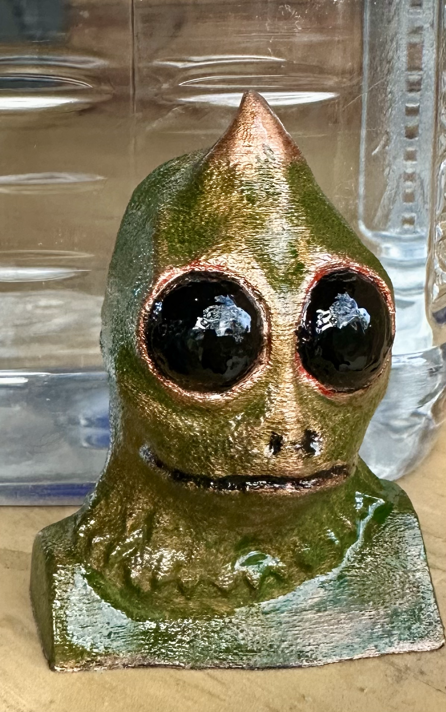

[Image source](journals/prints/prints_sleestack.png)

### Text
Size
Qa 4
Se 7 ry ip
Lf aN by bins 3
ies

---

@LAT72LON0 | created:1772201002 | updated:1772201002

## Projects Horn Grill
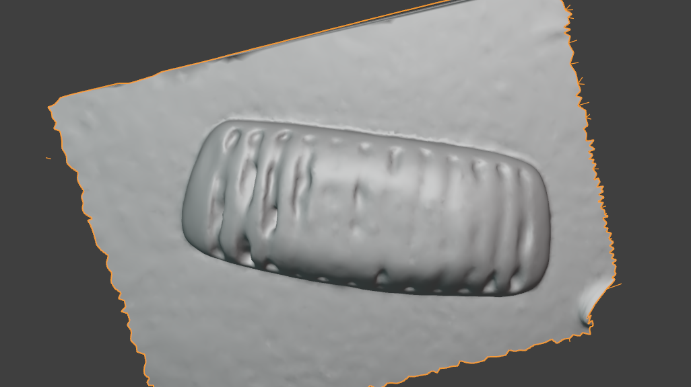

[Image source](journals/projects/projects_horn_grill.png)

### Text
_No clear OCR text detected._

---

@LAT68LON0 | created:1772201002 | updated:1772201002

## Spatula


[Image source](journals/robots/Spatula.png)

### Text
yy
AN 4
ee e 4
er
at oe

---

@LAT64LON0 | created:1772201002 | updated:1772201002

## Sbt 1


[Image source](journals/sbt/sbt_1.png)

### Text
Eg ene en
The fabric of (A a
iS a. weave of two
a elemental forms of
thy or
and @the
actions and es
which connect the ie
fT WCan run
ee Ci re les, PSE
a on 8 4 J
Ml The semantic =e
GE meaning
Aimension, of ee

---

@LAT60LON0 | created:1772201002 | updated:1772201002

## Sbt 17


[Image source](journals/sbt/sbt_17.png)

### Text
A semantic bit ts An element of
lt can be. oe
represented. 05.0 am
8 transitional. Cd ae
dimensional space =f Ney
nee VA
And. i+ can represent the meaning of 7
B Molecular actions at micvecosmic
well 25s. the
of celesttal At the. scale ope
the cosmas, a5 well ds the
ing of my (the, 1a
the events wich have

---

@LAT56LON0 | created:1772201002 | updated:1772201002

## Sbt 19


[Image source](journals/sbt/sbt_19.png)

### Text
everything in our experience.
encoded. iy
Lo. YS ee
like a schem-.
see otic represent 5 am
a flow am
4) of Clectron
Another Thig that
Va one t
Concept Vectov. Concept these. A

---

@LAT52LON0 | created:1772201002 | updated:1772201002

## Sbt 23


[Image source](journals/sbt/sbt_23.png)

### Text
[the story of my
is constellation
4 i. Scales
oe am
Me -SXlooked JM Kr
7, A Stars
WS NE Zim NS
Z SSS eee 3
My es

---

@LAT48LON0 | created:1772201002 | updated:1772201002

## Sbt 5


[Image source](journals/sbt/sbt_5.png)

### Text
Some ning
Wha C a VS
because Ind
ag xs
saa ae
A+. the .essence. of Meaning 5 1 1 1 7 6 2048 1119 178 38 26.151924 —— 4 1 1 1 8 0 423 1191 1689 216 -1 5 1 1 1 8 1 423 1253 155 73 60.268005 rs 5 1 1 1 8 2 655 1252 166 84 77.486603 the 5 1 1 1 8 3 897 1253 499 154 0.000000 rogest 5 1 1 1 8 4 1458 1234 165 105 92.340385 of 5 1 1 1 8 5 1658 1191 349 156 13.830650 me) 4 1 1 1 9 0 427 1480 1693 107 -1 5 1 1 1 9 1 427 1490 317 86 94.792976 What 5 1 1 1 9 2 814 1491 167 96 88.047523 js. 5 1 1 1 9 3 1050 1492 111 84 49.215195 at 5 1 1 1 9 4 1277 1487 278 93 83.214226 stake 5 1 1 1 9 5 1623 1480 330 95 26.215645 from 4 1 1 1 10 0 614 1666 1768 87 -1 5 1 1 1 10 1 487 1662 166 74 18.294563 NniSS 5 1 1 1 10 2 730 1666 576 75 68.977058 MOMCW)WT. 5 1 1 1 10 3 1382 1731 86 5 47.702744 <—— 5 1 1 1 10 4 1626 1730 399 26 41.375675 wee 5 1 1 1 10 5 2377 1727 5 3 46.437336 | 4 1 1 1 11 0 1466 1725 923 193 -1 5 1 1 1 11 1 433 1824 465 82 16.983231 the. 5 1 1 1 11 2 975 1840 368 69 42.407310 next 4 1 1 1 12 0 672 1975 1725 172 -1 5 1 1 1 12 1 445 1999 99 67 87.819939 is. 5 1 1 1 12 2 643 1999 186 67 86.955482 the 5 1 1 1 12 3 892 1990 299 74 14.285583 ACI 5 1 1 1 12 4 1245 1975 325 157 14.285583 ANAS. 5 1 1 1 12 5 1632 2058 352 18 47.526123 Ro 5 1 1 1 12 6 2156 1994 71 153 79.430756 | 5 1 1 1 12 7 2395 2061 2 2 76.286110 | 4 1 1 1 13 0 641 2057 1760 160 -1 5 1 1 1 13 1 523 2066 1032 151 36.515228 ENE 5 1 1 1 13 2 1774 2057 454 99 23.406349 Sse 4 1 1 1 14 0 462 2139 1944 126 -1 5 1 1 1 14 1 462 2173 82 62 13.543839 st 5 1 1 1 14 2 711 2139 845 126 43.564247 potentials 5 1 1 1 14 3 1459 2135 124 135 58.807716 *. 5 1 1 1 14 4 1719 2226 87 4 28.199203 are 5 1 1 1 14 5 2403 2230 3 3 56.842392 | 4 1 1 1 15 0 720 2308 1695 113 -1 5 1 1 1 15 1 468 2314 172 92 84.355820 the 5 1 1 1 15 2 720 2308 1105 113 0.000000 ZMSSOMANTICMbITS 5 1 1 1 15 3 2146 2314 269 92 0.752762 4 4 1 1 1 16 0 425 2560 2010 147 -1 5 1 1 1 16 1 425 2592 103 92 54.551010 lt 5 1 1 1 16 2 630 2592 428 97 93.074936 means 5 1 1 1 16 3 1139 2584 487 99 85.218330 what.i+ 5 1 1 1 16 4 1722 2560 360 147 68.691574 MEANS 4 1 1 1 17 0 439 2776 1969 80 -1 5 1 1 1 17 1 439 2776 136 74 94.473938 to 5 1 1 1 17 2 710 2781 261 75 76.013847 me. 5 1 1 1 17 3 1224 2836 3 2 6.489250 af 5 1 1 1 17 4 1419 2797 247 59 32.261055 Ow. 5 1 1 1 17 5 2404 2759 43 96 92.503647 4

---

@LAT44LON0 | created:1772201002 | updated:1772201002

## Umwelt 75


[Image source](journals/umwelt/umwelt_75.png)

### Text
Settee 3
7 Cy fs y j
j Z
Le
Nw at, N iN enn
am a
Saw) e
bd Sa ery A 4 gs
A A
MA
ey JZ f GsMENS LON A
pe
on Z
gg Contai
inet ot jearnt
lg pT DB
D Ss a (aes
evev time
3 e ta
e o ee ne
GOIN Oo
ah Fie ey
enon ae TR
TE RT (hock

---

@LAT40LON0 | created:1772201002 | updated:1772201002

## Umwelt 83


[Image source](journals/umwelt/umwelt_83.png)

### Text
nM
emitter
w ave S J
a Se perceptron
a 6. words

---

@LAT36LON0 | created:1772201002 | updated:1772201002

## Umwelt 84


[Image source](journals/umwelt/umwelt_84.png)

### Text
RRO AE RO
ce
OMe ity
(2) a re a a ra of TE ty
Al ap a Migs be
Pix t
h OO
nS ‘4
hie i
Means dD
id Le
hes as
St an Bee
Wy hyn

---

@LAT32LON0 | created:1772201002 | updated:1772201002

## Vectors 1
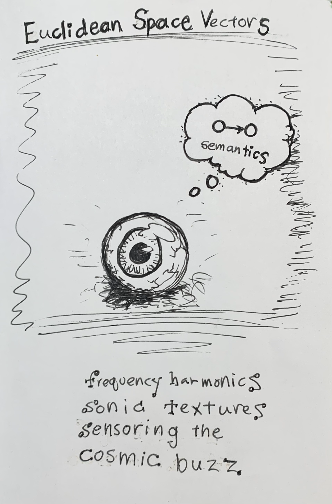

[Image source](journals/vectors/vectors_1.png)

### Text
Buclt dean Spc Vectove
Wor
f a
N an ti Cc
5 S$ Fe
Nie ie
p aes
tse
ne Pe oe
al
AY MONIC
Sonia text vey
g the
7 cosmii
COSMIC

---

@LAT28LON0 | created:1772201002 | updated:1772201002

## Vectors 10
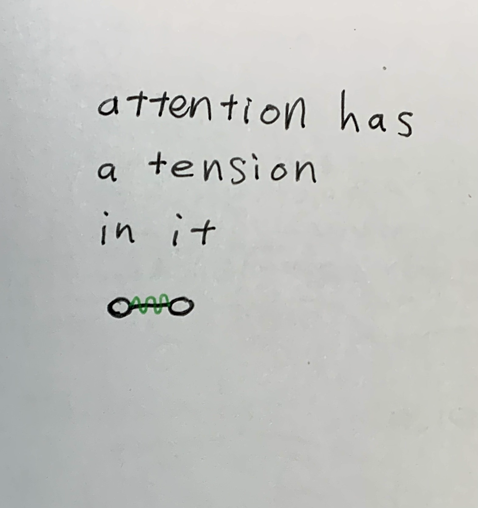

[Image source](journals/vectors/vectors_10.png)

### Text
a tension
In
Oro

---

@LAT24LON0 | created:1772201002 | updated:1772201002

## Vectors 12
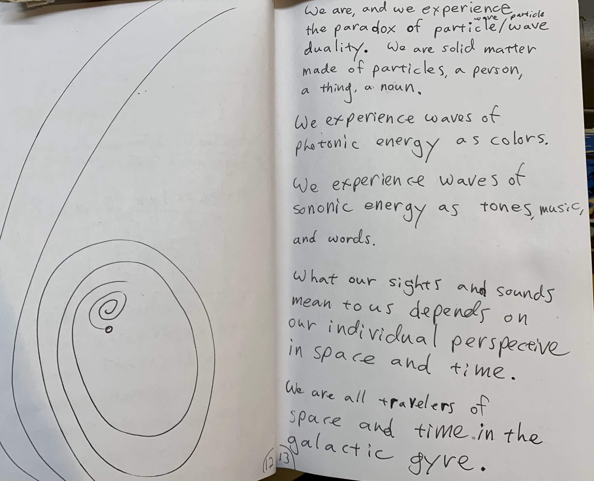

[Image source](journals/vectors/vectors_12.png)

### Text
a mr (oe ave, and we EX PENIENCE
the paradox of particle/wave
duality. We ave solick mattey
made of a
a a
Waves ot
photonic aS colors.
Je Waves at
sonoM as tones music,
and words.
What our s;
Mean Sounds
OuSs de
oO ind M
al travelers of
hd th
Ql a CT
pun

---

@LAT20LON0 | created:1772201002 | updated:1772201002

## Vectors 16


[Image source](journals/vectors/vectors_16.png)

### Text
Se C starlight 3
my eve
spooky action at aistance,
of cons
is 1S. oa
and
isalso ay
1 ticle
Ww Pa y A aN he
EIN Tell cea
ce
when it stvike
Maa 2 Cy
me” bit ot (S
aA chain veactin
Mm a pattevn of
thy the ce Sr ay
oT My prain Feads

---

@LAT16LON0 | created:1772201002 | updated:1772201002

## Vectors 18
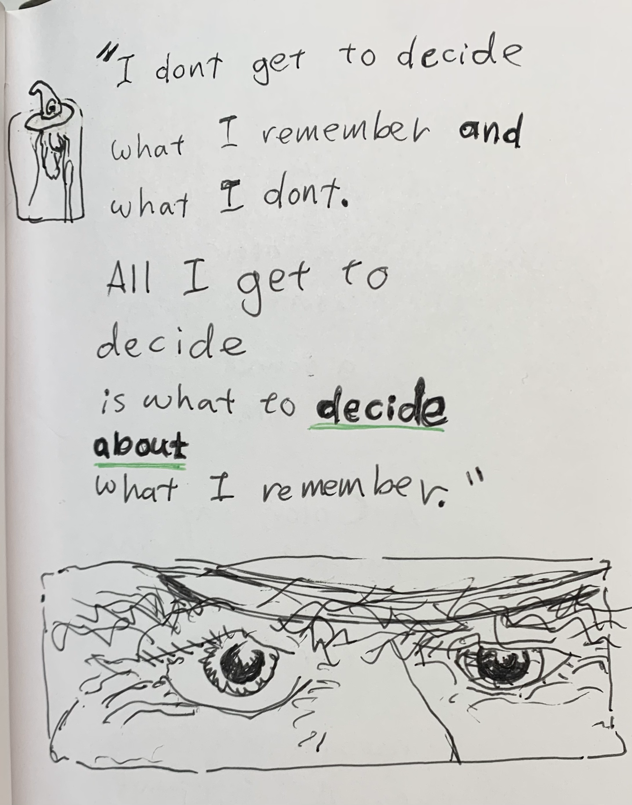

[Image source](journals/vectors/vectors_18.png)

### Text
Ba T vemembkel and
what G dont.
NW get
decide
is what to decide
about
What L
to
es f

---

@LAT12LON0 | created:1772201002 | updated:1772201002

## Vectors 2


[Image source](journals/vectors/vectors_2.png)

### Text
Con Scious Be
iS AwWave, Not a Particles Ov
a Process, not a thing.
WY
story Wa
tional
Frame
mpothetically...
The process of experience
can be described jn the
mathematical terms
of a quantum wave function,
Entanglement
anda transform
at the Frequency of
attentional blink,
dant
rmMe 4

---

@LAT8LON0 | created:1772201002 | updated:1772201002

## Vectors 21
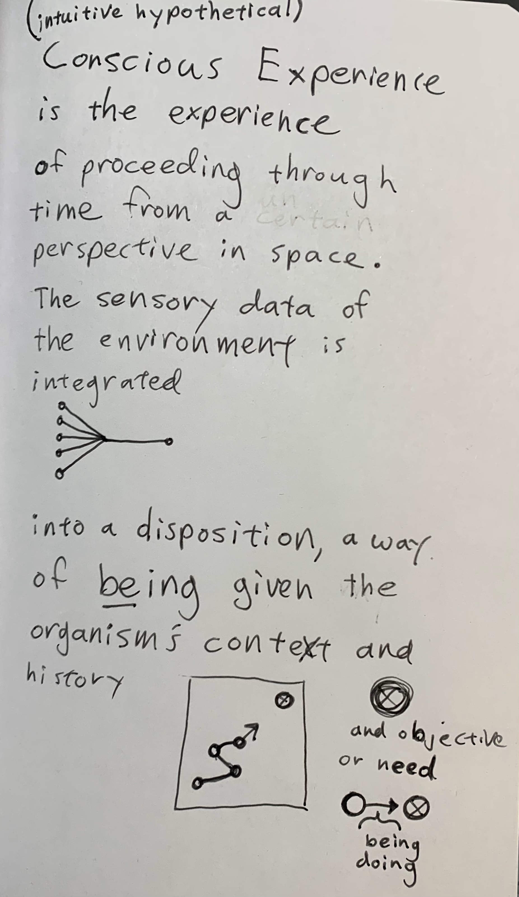

[Image source](journals/vectors/vectors_21.png)

### Text
(jntui tive hypothetical)
E x penien ce
1S the expNience.
of throug ie
perspective in Space,
The AN data of
the environ is
into a disposition, a War
of being the
5 Con text And
anol
Be need
bein
doings

---

@LAT4LON0 | created:1772201002 | updated:1772201002

## Vectors 31
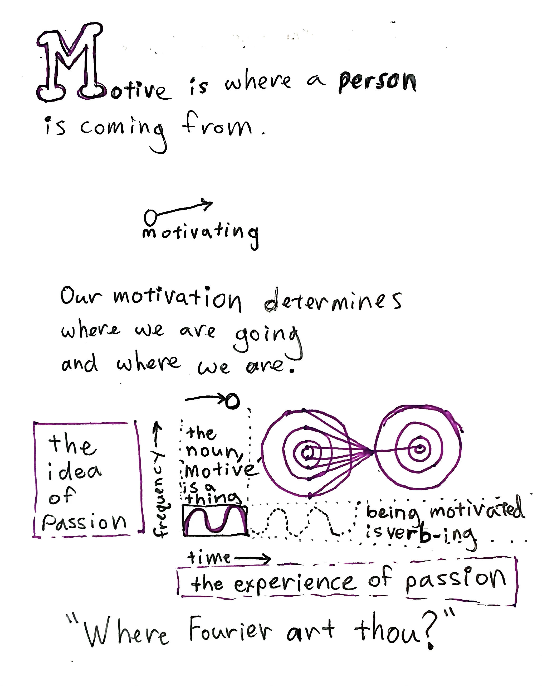

[Image source](journals/vectors/vectors_31.png)

### Text
Me is wheve a person
1S coming Lom
Our wmotivat]
ur motivation determing S
anc where Wwe ave,
rhe,
the
i AGA Motive
of 3)
[Passion oy oy; bein
the experience of passton
ANT
W heve Fourier thou?

---

@LAT0LON0 | created:1772201002 | updated:1772201002

## Vectors 32
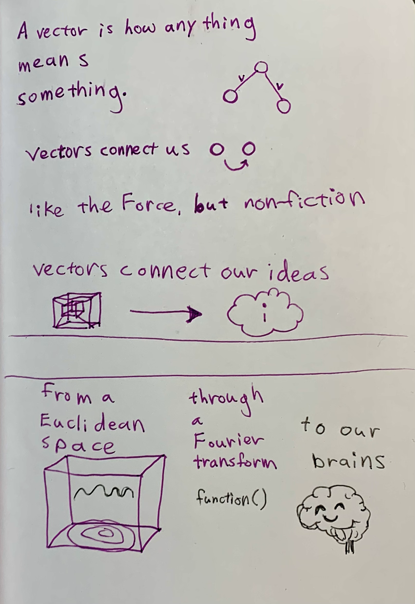

[Image source](journals/vectors/vectors_32.png)

### Text
A vector is how any thing
mean S
some
Vectovs connect US O O
iske the Force, but Vr
VectoVS
EEE
From a
Eucli dean
Space Fourie
vy

---

@LAT-4LON0 | created:1772201002 | updated:1772201002

## Vectors 38


[Image source](journals/vectors/vectors_38.png)

### Text
hs humans we like +o imaging
WR AV a
ant Ww a ls
fj a
lt+isas rp when we
U)e see
Aiffevent.
ee the same tvee, Out
mek h ave
and
t an 4 of i
So oe

---

@LAT-8LON0 | created:1772201002 | updated:1772201002

## Vectors 42


[Image source](journals/vectors/vectors_42.png)

### Text
oS
to my Space
Phase lock A
loop
bs
lake
oS
fan cinging the dance

---

@LAT-12LON0 | created:1772201002 | updated:1772201002

## Vectors 51


[Image source](journals/vectors/vectors_51.png)

### Text
AM PROCESSING
2 g DATA
we:
mo 4
LOVE STORIES
mat Ger
thins
(0 othe
ya
roost ae fy is
J Coffee

---

@LAT-16LON0 | created:1772201002 | updated:1772201002

## Vectors 6


[Image source](journals/vectors/vectors_6.png)

### Text
YA kitten) SC were
Oe Cay 60
D Like an
LO, Om] Loo 00
6 Pattern S of
SyM lod
where Oecan be
Say Thine and
Can be any
vero
oO” Velations hip,
Lv ar,

---

@LAT-20LON0 | created:1772201002 | updated:1772201002

## Vectors 78


[Image source](journals/vectors/vectors_78.png)

### Text
mThe brain is a Storage
SA Stoves Symbol 5.
The nodes and ed aes that
mm experiences of color and
land touch Anand Polically
Weurons Aa i
[BA memorable moMent My 2
er ae ASA ee
wierd Wen NSF ON USS ed ind
WHA ig what the mi Na took
WER or Suri) zed in the electro-chemica
vepresentations of the
nf |i li Ke read fi
Ps
4 m WH PAT throu ah
Bb the nodes and edae S

---

@LAT-24LON0 | created:1772201002 | updated:1772201002

## Vectors 84
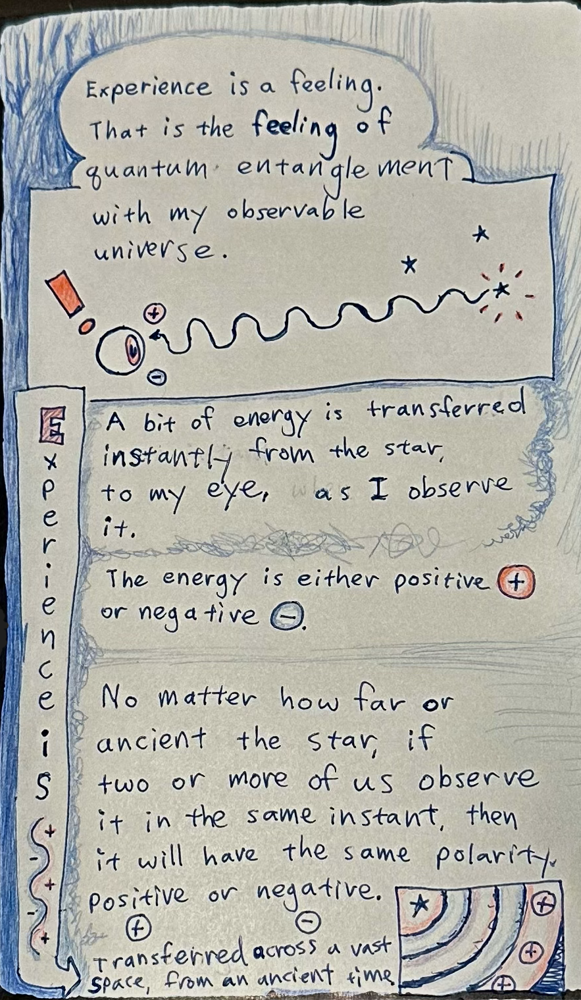

[Image source](journals/vectors/vectors_84.png)

### Text
Wii Experience 15 a feeling.
a That is the Feeling of
th my observable
ancient the stan if
two oF more of us observe
it in tre same instant, then
tt will have the same Polarity,
ret v neaative
S [2 Positive ‘it
7 Space, From an anctel\ 8 aa

---

@LAT-28LON0 | created:1772201002 | updated:1772201002

## Vectors 9


[Image source](journals/vectors/vectors_9.png)

### Text
i wee gh bres “i 4
REE sa 1 con Leer y
i AN ds
is aioe AG g a
aCe lousness iS Not
Re
xt 2 wy
A (re a Ae
Pra A aw, A Sars
ere ee
ee pes 4 wy? a
g's al yo Presa 4 ah:
ry ug?
Stet vi hy Sa
mies y
7 nd ae My
og
ene mo) 4
Mes ese vas Vou
ET af Med a iy Tha a ip Vere. 3
ES ae re
for Nel Nea
Lakes sea Le ae
ee ga

---

@LAT-32LON0 | created:1772201002 | updated:1772201002

## Waves 107


[Image source](journals/waves/waves_107.png)

### Text
aw ov QO
Kn Y lire 5...
ame graphs Know your parts fala 4 ees
i| MA.
Altgn ouy-, molecul WO) ee” y Lh ae,
eS ee. Went places
are Poy
yesPonse as ae Be ay sip
Cee 7 iL Ye]
i ee 5) ere im NX ee
0 Ae
ee RR tp Scots ee
a he tight. no
CO
f Each ove
a stom,
or oe Uf Ever: rae
etal
birth some
es
per cite
intent
ve n dayS Are TA
ee

---

@LAT-36LON0 | created:1772201002 | updated:1772201002

## Waves 113


[Image source](journals/waves/waves_113.png)

### Text
He
eoretical oo Ty. q a
Fats
ae
and fine
cine
thw a of
META 0
0-0 The true story of
What events:
Our treatmend of others
oe
of ony. experience
wt

---

@LAT-40LON0 | created:1772201002 | updated:1772201002

## Waves 149
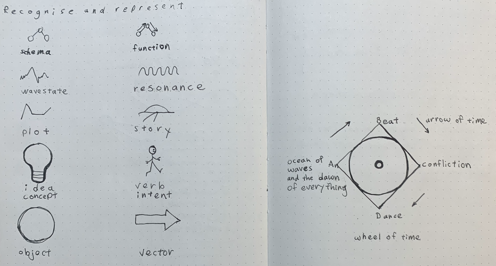

[Image source](journals/waves/waves_149.png)

### Text
ot)
ag.
ee
io ere...
ea ee
ccc err. Me NZ

---

@LAT-44LON0 | created:1772201002 | updated:1772201002

## Waves 15


[Image source](journals/waves/waves_15.png)

### Text
Oa ee ve re
From my perspective oe tind tat
perspective in this moment in HME at Peery ae
ee oe y mewo IS persist
heve on Barth Stay through the
i, a straw er made when L ol av;
OF Ova letter th
potnt on the ma? in my lights up. tele Scope eyes ansthev The story
euron 5 comect, via ae phetohic the
quanti realy, vierdly the Star and I, In. 2.02.2. Fhe profound
that _seemeimpossible,
LO hes L observe the eee now seem
TAG ey
Pe Cosmic ell:
ee onthe weve
en 5
eee tn
record entanalementS. ve Guy bis. Wbeve anciencent ii ht, billims
LT ama com CA Pie a:
So. 7
Re 1 on
wry ar wave and OM Favtht
nase 6 i} eS GE
This OCT nerdy, AN SE i

---

@LAT-48LON0 | created:1772201002 | updated:1772201002

## Waves 151
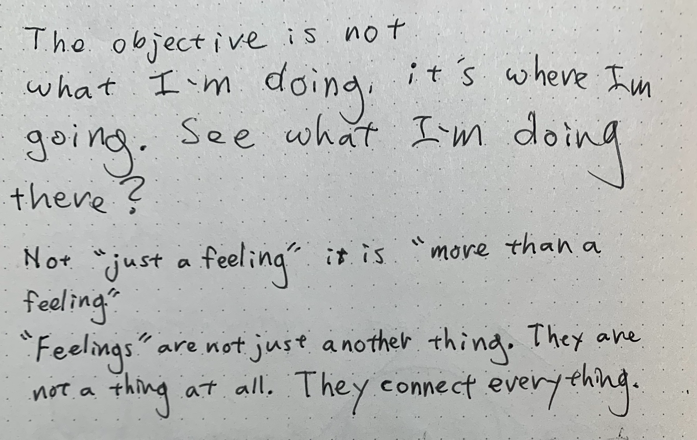

[Image source](journals/waves/waves_151.png)

### Text
brace
what doing whee Ty:
hoe what In a
Not “gust a feeling” iF is. “move
Feelings” are not just another thindy They ere
thing ot all. They connect EO a

---

@LAT-52LON0 | created:1772201002 | updated:1772201002

## Waves 152


[Image source](journals/waves/waves_152.png)

### Text
SE
my which cor
A place to hola on ae
w@an todo 7
ESD inte
eee tm

---

@LAT-56LON0 | created:1772201002 | updated:1772201002

## Waves 154


[Image source](journals/waves/waves_154.png)

### Text
ae
yn our relationships
people aids
ee er AL,
ee eS,
OR they
connect.
ins things,
NOUNS
EE aS ee

---

@LAT-60LON0 | created:1772201002 | updated:1772201002

## Waves 155


[Image source](journals/waves/waves_155.png)

### Text
the Lea Bron The Sen OF
AN.
obgecy abe ORGS Ba ae
principle of division for Pegi
WM
YY transformed tine ees ye.
er
function Bt Grecdic te k
Onde act) (Predicate)
Oe fee rangement ot
GDF pied
ee “are Converaent with
be special Language Theoretically ls
MGS pate, tka Dear
sada Peo
upon. a 4 ao yintention. 2
(Uff a rn
on Wars et
a Gates Agel SA CE
Less te
etc tor

---

@LAT-64LON0 | created:1772201002 | updated:1772201002

## Waves 159


[Image source](journals/waves/waves_159.png)

### Text
Semantic
say Ce
COSMIC
[eee ee
the ore
as Aly?
civeulated in the horizon, et WA
my whet
go wit the people and ae
eee S SPACE

---

@LAT-68LON0 | created:1772201002 | updated:1772201002

## Waves 8


[Image source](journals/waves/waves_8.png)

### Text
Human
Origami The Cereb ra
the surface;
Miura Fold Similarly deeply
ge
COR Arey
wy a
(Y) ae ylamals have smooth and
bral ie.
MG grown
oe La round ADS? mayne,
ear New things sists ot
updating, repair ne, replacina, and
Se
What Cer
Thy rs ike. ow map of every
ow. L So Lan,
lt is limited bY the INS
of the hard Wave, but it isnt
only, hes cab any ths minds
NLP Neural Proarammi nd ANAS tha Move
and
Coanitivé Behavioral Thevapy/ tore ave
Lov ve wi ing vane?

---

@LAT-72LON0 | created:1772201002 | updated:1772201002

## Waves 88


[Image source](journals/waves/waves_88.png)

### Text
i mother
Nl CAR AR
Ar the
AD inothor BS FI
cH ay
Fe ‘VG Go 2 SS ica
GAA
gg OG

---
