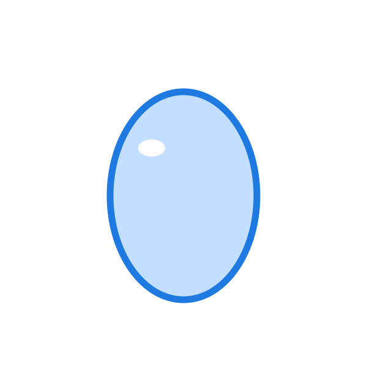

# One Drop TTDB
A moving story about a drop drop of rain.

```mmpdb
db_id: ttdb:one:drop:v1
db_name: "OneDrop"
coord_increment:
  lat: 10
  lon: 10
collision_policy: southeast_step
timestamp_kind: unix_utc
umwelt:
  umwelt_id: umwelt:one:drop:narrator:v1
  role: narrator
  perspective: "First person, cinematic storytelling. Scenes are in records."
  scope: "Images from images/ and with TTDB structure aligned to RFCs/."
  constraints:
    - "optimise for continuity and flow between records/scenes and story elements."
  globe:
    frame: "one_drop_map"
    origin: "Title scene starts the sequence."
    mapping: "Coordinates are intentionally spread across the globe while preserving next/prev sequence links."
    note: "This globe is a browseable transcription deck with broad spatial distribution."
cursor_policy:
  max_preview_chars: 260
  max_nodes: 40
typed_edges:
  enabled: true
  syntax: "type>@TARGET_ID"
  note: "Primary edges are next/prev sequence links across the deck."
librarian:
  enabled: false
```

```cursor
selected:
  - @LAT1LON1
preview:
  @LAT1LON1: "one drop story goes here."
```

---

@LAT-90LON0 | created:1771797310 | updated:1771797310

## TTDB Special Record: Tour Off

An option for this deck.

```ttdb-special
kind: discovery_tour_off

```

---

@LAT1LON1 | created:1771797450 | updated:1771797450  | type:scene

## One Drop
This is the story of one drop of rain.

## [share link](share/onedrop.html)

```ttdb-scene
audio_path: sounds/one_drop_01.WAV
start_node: @LAT10LON10
loop: false
edge: down | from:@LAT10LON10 | to:@LAT20LON20 | hold_ms:3000 | duration_ms:3000 | dir_x:0 | dir_y:3000
edge: down | from:@LAT20LON20| to:@LAT-75LON-75 | hold_ms:9000 | duration_ms:12000 | dir_x:0 | dir_y:3000
edge: return_home | from:@LAT-75LON-75 | to:@LAT1LON1 | hold_ms:9000 | duration_ms:5000 | travel_px:15000
```

---

@LAT10LON10 | created:1771797450 | updated:1771797450  


# One Drop

---

@LAT20LON20 | created:1771797450 | updated:1771797450  



---

@LAT-75LON-75 | created:1771797450 | updated:1771797450  


# the end

### credits

H2O

water bears:
 - bob
 - sally
 
no water was harmed   
in the making   
of this movie   

#### (c) 2026 toot toot engineering, all signals cleared